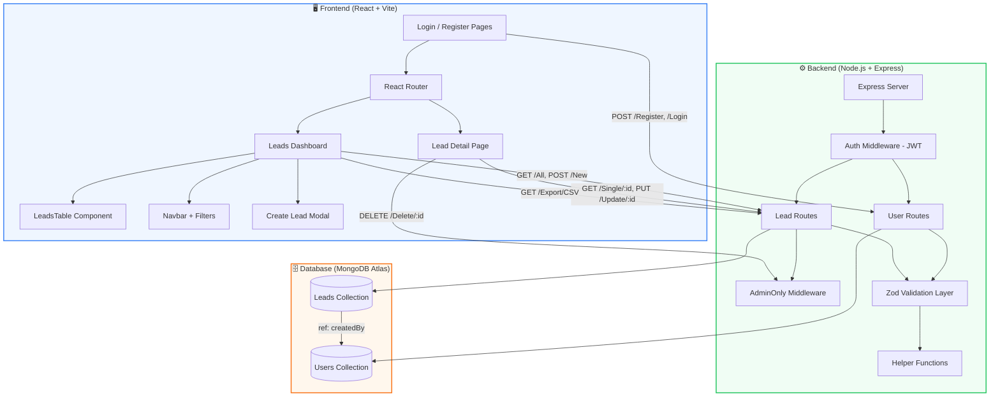
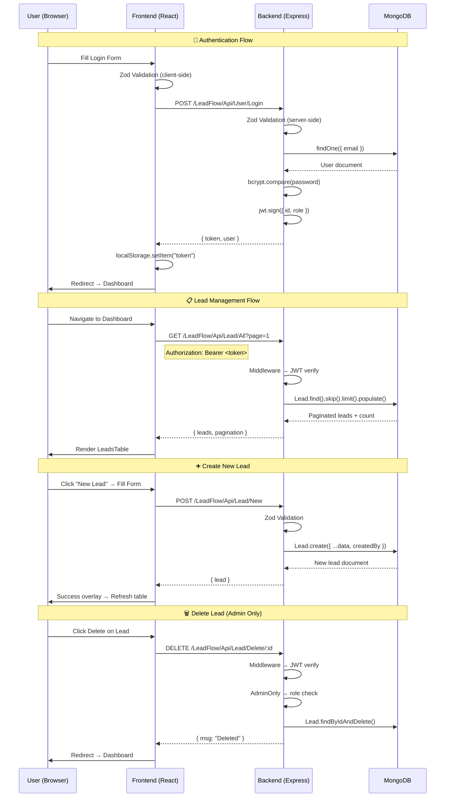
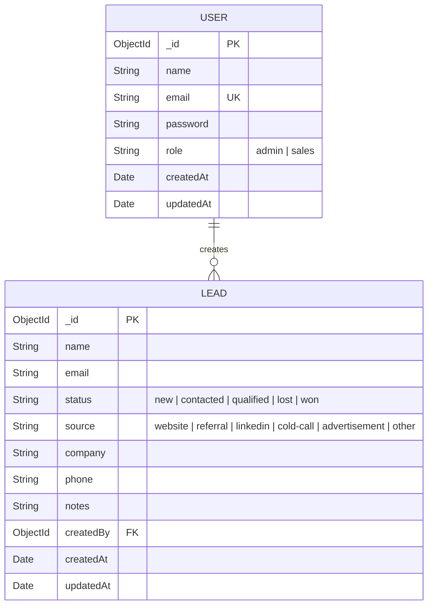

<p align="center">
  <h1 align="center">📊 LeadFlowCRM</h1>
  <p align="center">
    <strong>A Smart Leads Dashboard — Full-Stack CRM for Modern Sales Teams</strong>
  </p>
  <p align="center">
    Built with React • Node.js • Express • MongoDB • TypeScript
  </p>
  <p align="center">
    
    
    
    
    
    
  </p>
</p>

---

## 📌 Why Was This Built?

This project was developed as a **take-home assignment** for the **ServiceHive MERN Stack Internship** selection process. The goal was to demonstrate proficiency in building a full-stack web application using the **MERN stack** (MongoDB, Express.js, React, Node.js) with TypeScript, implementing:

- Secure JWT-based authentication with role-based access control
- A complete CRUD REST API with filtering, pagination, and sorting
- A responsive, production-ready frontend that communicates with the API
- Clean code architecture with proper separation of concerns

---

## 💡 What is a CRM?

**CRM (Customer Relationship Management)** is a system used by businesses to manage interactions with current and potential customers. It centralizes customer data — contact information, communication history, deal stage, and lead source — into one platform, enabling sales teams to:

- **Track leads** through every stage of the sales pipeline
- **Prioritize opportunities** based on qualification and engagement
- **Automate workflows** like follow-up reminders and status updates
- **Generate reports** to measure team performance and forecast revenue

### Real-Life Usage

| Industry | CRM Use Case |
|---|---|
| **SaaS Sales** | Track free-trial signups → demo requests → paid conversions |
| **Real Estate** | Manage buyer inquiries from property listings, open houses |
| **E-Commerce** | Monitor wholesale leads from trade shows and LinkedIn outreach |
| **Consulting** | Pipeline management from initial contact to signed contracts |
| **Healthcare** | Patient referral tracking and partner relationship management |

Popular CRM platforms include **Salesforce**, **HubSpot**, **Pipedrive**, and **Zoho CRM**. LeadFlowCRM demonstrates the core mechanics that power these enterprise tools.

---

## 🏗️ System Architecture



---

## 🔄 Application Workflow



---

## 📊 ER Diagram (Entity Relationship)



**Relationships:**
- One **User** can create many **Leads** (1:N)
- Each **Lead** has a `createdBy` field referencing the **User** who created it
- Both schemas use Mongoose `timestamps: true` for automatic `createdAt` / `updatedAt`

---

## 🛠️ Tech Stack

| Layer | Technology | Purpose |
|---|---|---|
| **Frontend** | React 19 + TypeScript | Component-based UI with type safety |
| **Styling** | TailwindCSS 3 | Utility-first CSS with custom design tokens |
| **Bundler** | Vite 8 | Lightning-fast HMR and build tooling |
| **Routing** | React Router DOM | Client-side SPA navigation |
| **HTTP Client** | Axios | Promise-based HTTP requests to API |
| **Validation (FE)** | Zod | Client-side form validation before API call |
| **Backend** | Node.js + Express 5 | REST API server |
| **Database** | MongoDB Atlas + Mongoose 9 | NoSQL document store with ODM |
| **Auth** | JWT (jsonwebtoken) + bcrypt | Token-based auth with password hashing |
| **Validation (BE)** | Zod | Server-side request body validation |

---

## ✨ Features

### 🔐 Authentication & Authorization
- **Register** with name, email, password, and role selection (Admin / Sales)
- **Login** with email & password → JWT token returned and stored in `localStorage`
- **Role-Based Access Control (RBAC):**
  - `admin` → Full CRUD access including **delete**
  - `sales` → Can create, read, and update leads — **cannot delete**
- **Protected Routes** — Dashboard and API endpoints require valid JWT

### 📋 Lead Management (Full CRUD)
- **Create** leads with name, email, status, source, company, phone, notes
- **Read** all leads with a rich data table including avatar initials, status badges
- **Update** any lead via an edit modal with pre-filled fields
- **Delete** leads (admin only) with confirmation dialog
- **View** individual lead details on a dedicated page

### 🔍 Search, Filter & Sort
- **Debounced Search** (400ms) — search by name or email across all leads
- **Status Filter** — filter by `New`, `Contacted`, `Qualified`, `Lost`, `Won`
- **Source Filter** — filter by `Website`, `Referral`, `LinkedIn`, `Cold Call`, etc.
- **Sort Toggle** — switch between newest-first and oldest-first

### 📄 Backend Pagination
- Server-side pagination with `skip` and `limit` (10 per page)
- Dynamic pagination buttons with ellipsis for large datasets
- Displays "Showing X to Y of Z leads"

### 📥 CSV Export
- Export filtered/sorted leads as a downloadable `.csv` file
- Respects current search, status, and source filters

### 🎨 UI / UX
- **Error Overlays** — Auto-dismissing (3s) red-bordered modal on any error
- **Success Overlays** — Green-bordered confirmation modals for create/update
- **Welcome Overlay** — Blue-bordered welcome-back screen on login
- **Loading States** — Animated spinners in buttons and full-page loading
- **Empty States** — Friendly message when no leads match filters
- **Responsive Design** — Works on mobile, tablet, and desktop
- **Smooth Animations** — `animate-fade-in` on page transitions and overlays

---

## 📂 Project Structure

```
LeadFlowCRM/
├── backend/
│   ├── .env                          # Environment variables
│   ├── package.json                  # Dependencies & scripts
│   ├── tsconfig.json                 # TypeScript configuration
│   └── src/
│       ├── index.ts                  # Express server entry point
│       ├── DB/
│       │   └── db.ts                 # Mongoose schemas (User, Lead)
│       ├── Routes/
│       │   ├── User/
│       │   │   └── User.ts           # Register, Login, Me endpoints
│       │   └── Lead/
│       │       └── Lead.ts           # CRUD, Pagination, CSV endpoints
│       ├── Middleware/
│       │   └── middleware.ts          # JWT auth + AdminOnly guard
│       ├── Validations/
│       │   └── ZodValidations.ts      # Zod schemas for all endpoints
│       ├── Helper/
│       │   └── Helper.ts             # Filter builder, sort builder, CSV generator
│       └── StatusCodes/
│           └── StatusCodes.ts         # HTTP status code enums
│
├── frontend/
│   ├── package.json                  # Dependencies & scripts
│   ├── tailwind.config.js            # Custom colors, animations
│   ├── postcss.config.js             # PostCSS setup
│   ├── index.html                    # HTML entry point
│   ├── vite.config.ts                # Vite configuration
│   └── src/
│       ├── main.tsx                  # React DOM entry
│       ├── App.tsx                   # BrowserRouter + Routes
│       ├── App.css                   # Global CSS
│       ├── index.css                 # Tailwind directives
│       ├── BackendUrl/
│       │   └── BackendUrl.tsx        # API base URL constant
│       ├── Validations/
│       │   └── ZodValidations.tsx    # Client-side Zod schemas
│       ├── Pages/
│       │   ├── Login.tsx             # Login page with overlays
│       │   ├── SignUp.tsx            # Registration with role picker
│       │   ├── LeadsDashboard.tsx    # Main dashboard + create modal
│       │   ├── LeadDetailsDashboard.tsx # Single lead view + edit
│       │   └── AdvancedSearchDashboard.tsx
│       ├── Components/
│       │   ├── UI/
│       │   │   ├── Buttons.tsx       # Reusable button component
│       │   │   └── Inputs.tsx        # Reusable input component
│       │   ├── Leads/
│       │   │   └── LeadsTable.tsx    # Paginated leads table
│       │   ├── DasboardNavbar/
│       │   │   └── DNavbar.tsx       # Search bar + filter toggles
│       │   ├── SideBar/
│       │   │   └── Sidebar.tsx       # Navigation + user badge + logout
│       │   ├── LeadDetails/
│       │   │   ├── LeadProfileHeader.tsx
│       │   │   └── ContactInfoCard.tsx
│       │   └── Search/
│       │       ├── SearchFilters.tsx
│       │       └── SearchResultsTable.tsx
│       └── Icons/
│           ├── Google.tsx
│           ├── Github.tsx
│           ├── Admin.tsx
│           └── User.tsx
│
└── README.md                         # This file
```

---

## 🌐 API Reference

### Base URL: `http://localhost:8000`

### Authentication

| Method | Endpoint | Auth | Description |
|---|---|---|---|
| `POST` | `/LeadFlow/Api/User/Register` | ❌ | Create a new account |
| `POST` | `/LeadFlow/Api/User/Login` | ❌ | Login & receive JWT |
| `GET` | `/LeadFlow/Api/User/Me` | ✅ | Get current user info |

### Leads

| Method | Endpoint | Auth | Role | Description |
|---|---|---|---|---|
| `GET` | `/LeadFlow/Api/Lead/All` | ✅ | Any | List leads (paginated, filterable, sortable) |
| `GET` | `/LeadFlow/Api/Lead/Single/:id` | ✅ | Any | Get a single lead's details |
| `POST` | `/LeadFlow/Api/Lead/New` | ✅ | Any | Create a new lead |
| `PUT` | `/LeadFlow/Api/Lead/Update/:id` | ✅ | Any | Update a lead |
| `DELETE` | `/LeadFlow/Api/Lead/Delete/:id` | ✅ | **Admin** | Delete a lead |
| `GET` | `/LeadFlow/Api/Lead/Export/CSV` | ✅ | Any | Export leads as CSV |

### Query Parameters for `GET /All`

| Parameter | Type | Example | Description |
|---|---|---|---|
| `page` | number | `1` | Page number (10 results/page) |
| `search` | string | `"john"` | Search name or email (regex, case-insensitive) |
| `status` | string | `"qualified"` | Filter by status |
| `source` | string | `"linkedin"` | Filter by source |
| `sortBy` | string | `"createdAt"` | Field to sort by |
| `sortOrder` | string | `"desc"` | Sort direction (`asc` or `desc`) |

---

## 🚀 Deployment

The application is fully deployed and hosted on **Vercel**:
- **Frontend**: Deployed as a static React SPA on Vercel.
- **Backend**: Deployed as serverless Node.js functions on Vercel.
- **Database**: Hosted securely on MongoDB Atlas.

Both frontend and backend are seamlessly integrated in the cloud, offering a complete, production-ready environment.

---

## 🚀 How to Run Locally

### Prerequisites

| Tool | Version | Install |
|---|---|---|
| **Node.js** | v18+ | [nodejs.org](https://nodejs.org/) |
| **npm** | v9+ | Comes with Node.js |
| **MongoDB** | Atlas (cloud) or Local | [mongodb.com](https://www.mongodb.com/atlas) |
| **Git** | Any | [git-scm.com](https://git-scm.com/) |

### Step 1: Clone the Repository

```bash
git clone https://github.com/your-username/LeadFlowCRM.git
cd LeadFlowCRM
```

### Step 2: Setup the Backend

```bash
cd backend
npm install
```

Create a `.env` file in the `backend/` directory:

```env
MongoDB_URL=mongodb://localhost:27017/LeadFlowCRM
JWT_SECRET=your_super_secret_jwt_key_here
PORT=8000
```

> 💡 Replace `MongoDB_URL` with your **MongoDB Atlas connection string** if using cloud, or keep `localhost` for a local MongoDB instance.

Build and start the backend:

```bash
npm run dev
```

You should see: `Successfully listening on port 8000`

### Step 3: Setup the Frontend

Open a **new terminal** and run:

```bash
cd frontend
npm install
```

Verify the backend URL in `src/BackendUrl/BackendUrl.tsx`:

```tsx
export const VITE_BACKEND_URL = "http://localhost:8000";
```

Start the development server:

```bash
npm run dev
```

The app will open at `http://localhost:5173`

### Step 4: Create Your First Account

1. Navigate to `http://localhost:5173`
2. Click **"Create An Account"** (or go to `/LeadFlow/User/SignUp`)
3. Fill in your name, email, password and select a role:
   - **Admin** — Full access (can delete leads)
   - **Sales User** — Can create, view, and edit leads
4. After registration, you'll be redirected to the login page
5. Login with your credentials → Welcome overlay → Dashboard

### Step 5: Start Managing Leads

- Click **"New Lead"** to create your first lead
- Use the **search bar** and **filter toggles** to find specific leads
- Click the **eye icon** to view lead details
- Click **"Export CSV"** to download your leads as a spreadsheet

---

## 🧪 Testing the API Manually

You can test the backend API using **Postman** or **cURL**:

```bash
# Register
curl -X POST http://localhost:8000/LeadFlow/Api/User/Register \
  -H "Content-Type: application/json" \
  -d '{"name":"Admin User","email":"admin@test.com","password":"test123","role":"admin"}'

# Login
curl -X POST http://localhost:8000/LeadFlow/Api/User/Login \
  -H "Content-Type: application/json" \
  -d '{"email":"admin@test.com","password":"test123"}'

# Create a Lead (use token from login response)
curl -X POST http://localhost:8000/LeadFlow/Api/Lead/New \
  -H "Content-Type: application/json" \
  -H "Authorization: Bearer YOUR_TOKEN_HERE" \
  -d '{"name":"Jane Doe","email":"jane@example.com","status":"new","source":"linkedin"}'

# Get All Leads (paginated)
curl http://localhost:8000/LeadFlow/Api/Lead/All?page=1 \
  -H "Authorization: Bearer YOUR_TOKEN_HERE"
```

---

## 📐 Design Decisions

| Decision | Rationale |
|---|---|
| **JWT in localStorage** | Simple token management for SPA; trade-off vs httpOnly cookies acknowledged |
| **Zod on both client & server** | Fail-fast on the client → better UX; validate again on server → security |
| **useRef for form inputs** | Follows the existing TripzyAI codebase pattern; avoids re-renders on every keystroke |
| **Inline overlays vs toast library** | Matches TripzyAI's error/success pattern; no extra dependencies |
| **Backend pagination** | Efficient for large datasets; only fetches 10 records per request |
| **AdminOnly middleware** | Separate middleware function keeps route handlers clean |
| **Enum-based status codes** | Centralized, readable HTTP status management |

---

## 👨‍💻 Author

**Bhavesh Joshi**

Built as part of the **ServiceHive MERN Internship** selection assignment.

---

<p align="center">
  <sub>Built with ❤️ using the MERN Stack</sub>
</p>
